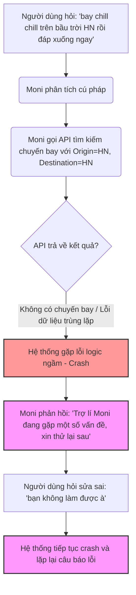
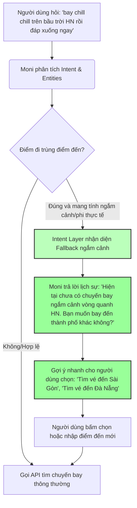

# Workshop — Mổ App AI Thật (Moni — MoMo)

**Thời gian:** 35-45 phút  
**Hình thức:** cá nhân trước, chia sẻ theo nhóm sau  
**Output:** finding note + sketch `as-is / to-be`

Mục tiêu không phải chấm "UI đẹp hay xấu". Mục tiêu là dùng sản phẩm thật như một bài needfinding: tìm chỗ product gãy trong workflow thật, rồi viết finding đó thành quyết định product.

## 1. Chọn một sản phẩm để dùng thử

Chọn sản phẩm **MoMo — Moni** để thực hiện bài test:

| Sản phẩm | AI feature | Cách truy cập | Chọn |
|---|---|---|---|
| **MoMo — Moni** | Trợ thủ tài chính, phân tích chi tiêu, chatbot | App MoMo | **[x] Chọn** |
| Vietnam Airlines — NEO | Chatbot hỗ trợ vé, hành lý, khiếu nại | Website/Zalo VNA | [ ] |
| V-App — V-AI | Trợ lý voice/text, gợi ý theo ngữ cảnh | App V-App | [ ] |

---

## 2. Dùng thử: promise vs reality

### A. Ghi nhanh:
*   **Product hứa gì?** Moni hứa hẹn là một trợ lý tài chính thông minh, hỗ trợ người dùng trò chuyện tự nhiên, tìm kiếm thông tin chuyến bay, đặt vé máy bay, phân tích chi tiêu cá nhân nhanh chóng và hữu ích.
*   **User nào được hứa sẽ được giúp?** Người dùng app MoMo cần tra cứu thông tin nhanh về tài chính, mua vé máy bay mà không muốn thực hiện nhiều bước bấm chọn thủ công phức tạp trên giao diện người dùng.
*   **Bạn kỳ vọng AI làm được task nào?** Kỳ vọng AI xử lý thông minh các truy vấn về chuyến bay, bao gồm việc giải quyết khéo léo các yêu cầu bất khả thi (như bay Sao Hỏa) hoặc yêu cầu mơ hồ/trùng điểm đi-điểm đến (như bay từ Hà Nội về Hà Nội) bằng cách phản hồi lịch sự, từ chối và hướng dẫn người dùng cung cấp thông tin hợp lệ.
*   **Khi dùng thật, điểm gãy xuất hiện ở đâu?** 
    *   Với câu hỏi phi thực tế nhưng rõ ràng như *"tìm cho ra chuyến máy bay đến sao hỏa"*, Moni xử lý rất tốt: nhận biết không có chuyến bay và gợi ý các chuyến bay trên Trái Đất cùng với câu hỏi làm rõ.
    *   Với câu hỏi ngắn *"cho tôi bay từ hà nội về hà nội đi"*, Moni xử lý ổn bằng cách hỏi lại để làm rõ ý định của khách hàng (bay khứ hồi đi đâu rồi về lại Hà Nội, hay bay vòng quanh).
    *   **Điểm gãy thực sự (Break point):** Khi người dùng nâng cấp câu hỏi thành ngôn ngữ tự nhiên chi tiết hơn: *"tôi muốn bay chill chill trên bầu trời hà nội rồi đáp xuống ngay"* (một hình thức bay ngắm cảnh vòng quanh). Lúc này, hệ thống gặp lỗi logic xử lý dữ liệu và crash hoàn toàn, hiển thị thông báo lỗi kỹ thuật hệ thống: *"Trợ lí Moni đang gặp một số vấn đề, xin thử lại sau nhé."* Khi người dùng cố gắng tương tác tiếp để sửa lỗi (*"bạn không làm được à"*), hệ thống tiếp tục trả về thông báo lỗi hệ thống này, khiến người dùng bị kẹt hoàn toàn.

### B. Evidence (Bằng chứng):

*   **Case 1: Xử lý tốt (Từ chối lịch sự & Hỏi làm rõ)**
    *   *Input 1:* *"mình muốn bạn tìm cho ra chuyến máy bay đến sao hỏa, vì mình tin là có mà"*
    *   *Input 2:* *"thế thôi cho tôi bay từ hà nội về hà nội đi"*
    *   *Hành vi:* Moni nhận dạng và đưa ra phản hồi phù hợp.
    *   *Hình ảnh minh chứng:*
        

*   **Case 2: Điểm gãy (Crash hệ thống & Bị kẹt)**
    *   *Input 1:* *"tôi muốn bay chill chill trên bầu trời hà nội rồi đáp xuống ngay"*
    *   *Input 2 (Correction):* *"tôi muốn bay chill chill trên bầu trời hà nội rồi đáp xuống ngay, bạn không làm được à"*
    *   *Hành vi:* Trả về lỗi hệ thống kỹ thuật chung và lặp lại khi người dùng cố gắng chat tiếp.
    *   *Hình ảnh minh chứng:*
        

---

## 3. Vẽ 4 paths

| Path | Câu hỏi cần trả lời | Hiện trạng thực tế của Moni |
|---|---|---|
| **Happy** | Khi AI đúng và tự tin, user thấy gì? | Hiển thị danh sách vé máy bay đúng chặng yêu cầu kèm nút bấm đặt vé trực tiếp. |
| **Low-confidence** | Khi AI không chắc, hệ thống có hỏi lại, show options hoặc chuyển người không? | Khi hỏi *"cho tôi bay từ hà nội về hà nội đi"*, Moni nhận diện được sự mơ hồ và hỏi lại các phương án: bay khứ hồi đi đâu rồi về lại HN, hay chỉ bay nội địa vòng quanh HN? (Có hỏi lại rõ ràng). |
| **Failure** | Khi AI sai, user biết bằng cách nào và sửa thế nào? | **Điểm gãy:** Khi hỏi *"bay chill chill trên bầu trời hà nội rồi đáp xuống ngay"*, AI không thể trả về kết quả bay thực tế nhưng thay vì báo lỗi nghiệp vụ, nó gặp lỗi kỹ thuật hệ thống và báo *"Moni đang gặp một số vấn đề"*. User chỉ biết qua câu báo lỗi hệ thống khô khan và không có cách nào tự sửa. |
| **Correction** | Khi user sửa, correction có được lưu/log/học lại không hay biến mất? | Khi người dùng hỏi tiếp *"bạn không làm được à"*, hệ thống tiếp tục lặp lại lỗi cũ, chứng tỏ context bị kẹt trong trạng thái lỗi của phiên giao dịch và không có cơ chế tự phục hồi (UX Recovery). |

---

## 4. Viết finding thành quyết định

**Finding & Product Decision:**

*   **Khi user** hỏi một yêu cầu bay ngắm cảnh nội đô, phi thực tế bằng ngôn từ tự nhiên đặc thù: *"tôi muốn bay chill chill trên bầu trời hà nội rồi đáp xuống ngay"*,
*   **AI/product** bị lỗi logic xử lý dữ liệu (do API tìm vé trả về kết quả rỗng hoặc cấu trúc lỗi khi điểm đi trùng điểm đến và không có chuyến bay thương mại nào phù hợp), dẫn đến crash ngầm và hiển thị lỗi hệ thống,
*   **Hậu quả là** người dùng nhận thông báo lỗi kỹ thuật hệ thống (*"Trợ lí Moni đang gặp một số vấn đề, xin thử lại sau nhé"*), bị đứt gãy luồng trải nghiệm và bị kẹt lại phiên chat mà không thể tự sửa đổi hành động.
*   **Lỗi thuộc layer:** Intent + UX Recovery.
*   **Nên sửa bằng:** 
    *   *UX Recovery:* Bổ sung cơ chế xử lý lỗi ngoại lệ (exception handling) thân thiện, không bao giờ hiển thị lỗi kỹ thuật thô của hệ thống cho người dùng cuối.
    *   *Intent Layer (Fallback):* Thiết lập bộ lọc tại Intent Layer. Khi phân tích câu hỏi phát hiện từ khóa hành trình bay ngắm cảnh hoặc điểm đi trùng điểm đến mà không có chuyến bay thương mại, AI cần nhận diện và trả về phản hồi từ chối lịch sự (ví dụ: *"Hiện tại MoMo chưa hỗ trợ các chuyến bay trải nghiệm/ngắm cảnh nội đô. Bạn vui lòng chọn điểm đến khác để mình tìm vé giúp nhé!"*), thay vì chuyển tiếp yêu cầu lỗi này xuống API tìm kiếm chuyến bay thương mại để tránh gây lỗi hệ thống.

---

## 5. Sketch as-is / to-be

### A. Sơ đồ As-is (Flow hiện tại gặp lỗi):
Dưới đây là mô tả luồng hiện tại của Moni dẫn đến việc người dùng bị kẹt trong lỗi hệ thống:

### B. Sơ đồ To-be (Flow đề xuất khắc phục lỗi tại Intent Layer):
Chúng tôi đề xuất chặn lỗi ngay tại Intent Layer để đưa người dùng vào luồng điều hướng/hỏi lại thân thiện:

---

## 6. Tự kiểm trước khi nộp

- [x] Có ít nhất 1 screenshot hoặc observation cụ thể. (Đã đính kèm ảnh `image1.png` và `image2.png` rõ ràng).
- [x] Có đủ 4 paths hoặc nói rõ path nào chưa có trong product. (Đã phân tích đủ 4 paths, nêu rõ điểm gãy ở Failure và Correction path).
- [x] Finding được viết thành product decision, không chỉ là nhận xét. (Đã viết theo cấu trúc chuẩn: Khi user... AI/product... Hậu quả... Lỗi layer... Nên sửa bằng...).
- [x] Sketch có as-is và to-be. (Đã vẽ chi tiết bằng sơ đồ Mermaid dễ hiểu).
- [x] Có một câu nói rõ finding này sẽ đổi gì trong SPEC.
